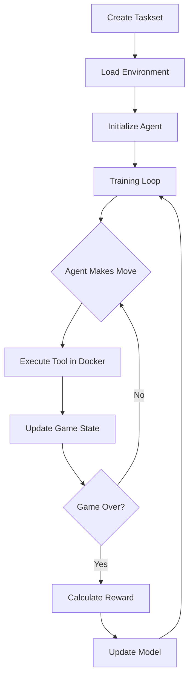

# 🎮 Minesweeper HUD Environment

A fully-featured Minesweeper environment built with the HUD framework for training AI agents using reinforcement learning. This environment demonstrates how to create interactive games for AI training with sophisticated reward systems, Docker containerization, and integration with modern RL frameworks.

## 🏗️ Architecture Overview

### System Components

```
┌─────────────────────────────────────────────────────────────────┐
│                         Training Loop                              │
│  ┌─────────────┐    ┌─────────────┐    ┌─────────────────────┐ │
│  │   Agent     │    │  HUD VF Gym │    │   Docker Container   │ │
│  │ (LLM Model) │◄──►│ Environment │◄──►│  (MCP Server)       │ │
│  └─────────────┘    └─────────────┘    └─────────────────────┘ │
└─────────────────────────────────────────────────────────────────┘
```

### Key Technologies
- **HUD Framework**: Orchestrates agent-environment interactions
- **MCP (Model Context Protocol)**: Enables tool calling between agents and environments
- **Verifiers Framework**: Provides RL training infrastructure
- **Docker**: Containerizes the game environment for isolation and reproducibility

## 📁 Repository Structure

```
minesweeper/
├── src/hud_controller/         # Game implementation
│   ├── server.py              # MCP server with game tools
│   ├── context.py             # Persistent game state
│   └── minesweeper.py         # Core game logic
├── hud-vf-gym/                # HUD-Verifiers integration
│   └── src/hud_vf_gym/
│       ├── hud_vf_gym.py      # Main gym environment
│       ├── mcp_utils.py       # MCP tool execution
│       ├── parsers.py         # XML parsing for tool calls
│       └── rubrics.py         # Reward calculation
├── configs/
│   └── minesweeper.yaml       # Environment configuration
├── quick_test.py              # Test agents on single games
├── create_taskset.py          # Generate training tasks
├── train_minesweeper.py       # GRPO training script
└── Dockerfile                 # Container definition
```

## 🔧 How It Works

### 1. Environment Creation

The Minesweeper environment runs in a Docker container with two processes:

1. **Context Server** (`context.py`): Maintains game state across tool calls
2. **MCP Server** (`server.py`): Exposes game actions as tools

When an agent wants to play:
```
Agent → MCP Client → Docker Container → MCP Server → Game State
```

### 2. Game Tools

The environment provides these MCP tools to agents:

- **`setup(rows, cols, num_mines)`**: Initialize a new game
- **`reveal(row, col)`**: Reveal a cell (might hit a mine!)
- **`flag(row, col)`**: Mark/unmark a suspected mine
- **`get_board()`**: View current board state
- **`evaluate()`**: Get game performance metrics

### 3. Docker Image Selection

The Docker image is specified in the task's `mcp_config`:

```python
mcp_config = {
    "minesweeper": {
        "command": "docker",
        "args": ["run", "--rm", "-i", "minesweeper:dev"]
    }
}
```

The image name (`minesweeper:dev`) can be:
- Hardcoded in the task dataset
- Set via environment variables: `${MINESWEEPER_IMAGE:-minesweeper:dev}`
- Different for dev/staging/production environments

### 4. Training Flow



### 5. Reward System

The reward function encourages strategic play over random clicking:

```python
# Expected cells by random play
E[X] = (N - M) / (M + 1)
where N = total cells, M = mines

# Reward calculation:
- If won: reward = 1.0
- If cells_revealed <= E[X]: reward = 0.0
- Otherwise: reward = 0.5 * (cells_above_random / max_possible_above_random)
```

Example (6×6 board, 6 mines):
- Random baseline: ~4.3 cells
- Revealing 4 cells → 0.0 reward
- Revealing 15 cells → ~0.208 reward
- Winning (30 cells) → 1.0 reward

## 🚀 Getting Started

### Prerequisites

- Python 3.11+
- Docker
- (Optional) 2 GPUs for vLLM training

### 1. Build the Docker Environment

```bash
# Build the Minesweeper game container
docker build -t minesweeper:dev .

# Test it's working
hud dev --image minesweeper:dev
```

### 2. Create Training Dataset

```bash
# Generate a taskset with various difficulties
python create_taskset.py

# This creates tasks with:
# - Easy: 5×5 boards with 3 mines
# - Medium: 7×7 boards with 7 mines  
# - Hard: 9×9 boards with 10 mines
```

### 3. Test with an Agent

```bash
# Quick test with Claude
python quick_test.py

# This will:
# 1. Start a Docker container
# 2. Initialize a 6×6 game
# 3. Have Claude play until win/loss
# 4. Show the reward earned
```

### 4. Train a Model

#### Option A: Simple Training (1 GPU)
```bash
# Install the HUD VF Gym
pip install -e ./hud-vf-gym

# Run training
python train_minesweeper_simple.py
```

#### Option B: vLLM Training (2 GPUs)
```bash
# Terminal 1: Start vLLM server on GPU 0
CUDA_VISIBLE_DEVICES=0 vf-vllm \
    --model Qwen/Qwen2.5-3B-Instruct \
    --enforce-eager \
    --disable-log-requests

# Terminal 2: Run training on GPU 1
CUDA_VISIBLE_DEVICES=1 python train_minesweeper.py
```

## 🎯 Configuration

### Environment Config (`configs/minesweeper.yaml`)

```yaml
defaults:
  max_turns: 30          # Max moves per game
  max_output_tokens: 512 # Token limit per response

system_prompt: |
  You are an AI agent playing Minesweeper...

action_mappings:
  reveal:                # Maps reveal(row,col) to MCP tool
    _tool: "reveal"
    row: {from_arg: "row"}
    col: {from_arg: "col"}
```

### Task Creation

Tasks include:
- **mcp_config**: Docker container specification
- **setup_tool**: Game initialization parameters
- **evaluate_tool**: Performance evaluation
- **prompt**: Instructions for the agent

## 🧪 Testing & Development

### Run Tests
```bash
# Test environment setup
python test_setup.py

# Test reward calculation
python test_reward.py

# See reward examples
python reward_demo.py
```

### Modify the Game

1. **Add new tools**: Edit `src/hud_controller/server.py`
```python
@mcp.tool()
async def hint(row: int, col: int) -> list[TextContent]:
    """Provide a hint for the given cell."""
    # Your implementation
```

2. **Change game rules**: Edit `src/hud_controller/minesweeper.py`
3. **Adjust rewards**: Modify the `evaluate()` function in `server.py`

### Debug Training

View training progress in real-time:
```bash
# Weights & Biases dashboard
wandb login
# Training logs at https://wandb.ai/your-username/minesweeper-grpo

# HUD traces
# View at https://app.hud.so
```

## 📊 Understanding the Training Process

### GRPO (Group Relative Policy Optimization)

The training uses GRPO to improve the agent's policy:

1. **Sampling**: Generate multiple game trajectories
2. **Evaluation**: Calculate rewards for each trajectory  
3. **Comparison**: Learn from better vs worse performances
4. **Update**: Adjust model weights to favor successful strategies

### Key Training Parameters

```python
args.per_device_train_batch_size = 5  # Games per batch
args.num_generations = 5              # Rollouts per game
args.max_steps = 100                  # Training iterations
```

## 🔍 Advanced Topics

### Custom Reward Functions

Modify `evaluate()` in `server.py`:
```python
@mcp.tool()
async def evaluate():
    # Your custom scoring logic
    if state["moves_made"] < 10 and state["won"]:
        bonus = 0.2  # Quick win bonus
```

### Multi-Environment Training

Create variants by:
1. Building different Docker images
2. Specifying in task configs
3. Training on mixed datasets

### Tool Call Parsing

The system uses XML format for tool calls:
```xml
<think>I should check the corner first</think>
<tool>reveal(0, 0)</tool>
```

## 🤝 Contributing

1. Fork the repository
2. Create a feature branch
3. Add tests for new functionality
4. Submit a pull request

## 📚 Learn More

- [HUD Documentation](https://docs.hud.so) - Framework details
- [MCP Specification](https://modelcontextprotocol.io) - Protocol spec
- [Verifiers Docs](https://github.com/poking-agents/verifiers) - RL training
- [Example Traces](https://app.hud.so) - See agents playing

## 🎮 Tips for Better Training

1. **Start Small**: Train on easy boards first
2. **Diverse Seeds**: Use different random seeds for variety
3. **Monitor Rewards**: Watch for reward hacking
4. **Iterate System Prompt**: Clear instructions improve performance
5. **Balance Dataset**: Mix difficulties appropriately

---

Built with ❤️ using the HUD framework